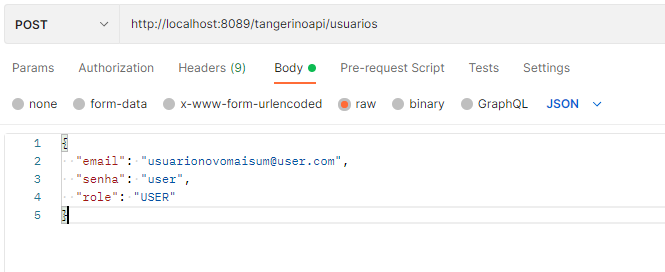
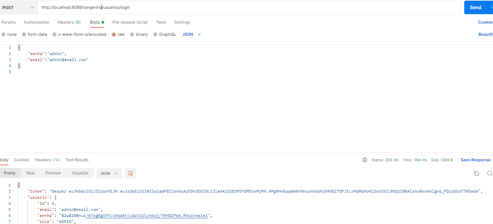
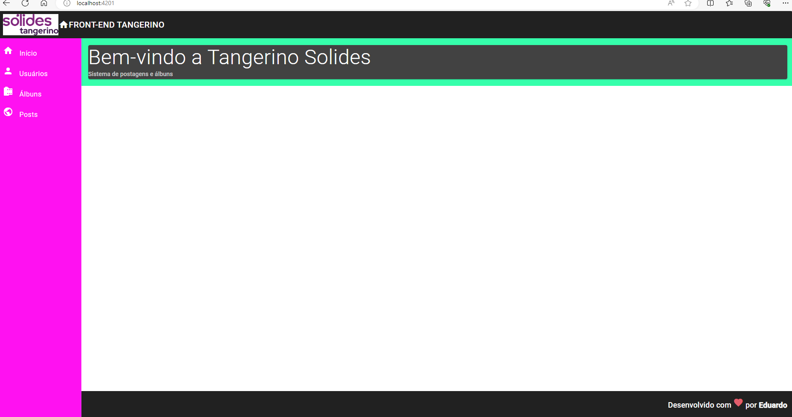

# Instruções básicas #

## Sobre opções técnicas ##

Infelizmente não tive tempo de colocar front-end e back-end integrados por motivos de doença e tempo. Para o Back-end escolhi Spring Boot 3 com Java 17. Fiz toda a autenticação de usuário utilizando JWT e aquilo que considero as melhores práticas do Spring Security. Implementei um banco Postgre local. Sobre os relacionamentos, considerei: Usuario 1xn Albuns, Usuario 1xn Posts, Usuario 1xn Comentários, Posts 1xn comentários, Albuns 1xn Fotos. Para utilizar o back-end, é necessário primeiro autenticar. Os únicos endpoints sem autenticação são os de login e os de criação de usuário. Peço que atente-se também à porta escolhida para back-end. Sempre escolho uma porta diferente da 8080, porque é uma porta que usualmente está bloqueada. Como não tive tempo de integrar, darei um passo a passo de como utilizar a API. Antes disso, comento sobre front-end. Escolhi o Angular 17 com design mínimo, isto é, criei por meio do ng new projeto --minimal além de ter utilizado o padrão --no-standalone. Utilizei o Material do Angular, acho uma biblioteca bem prática. Comecei a implementar o design de rotas, que vai até um formulário de cadastro de usuário, mas não tive tempo de ir mais adiante, integrando, posts, gets, etc.

### API

Primeiro o usuário deve enviar uma requisição para criar usuário, recomendo o postman, ou o swagger, que está como dependência. Para isso, acesse localhost:porta/swagger-ui.html. Utilize o post de usuário e envie o json necessário. 

Ao criar, deve-se autenticar. O token deve ser enviado na parte de autorização para QUALQUER outra requisição na API. Essa parte fica no Header, e é do tipo Bearer

### FrontEnd Angular

Abra a pasta de front end no terminal e execute o comando ng serve para subir a aplicação. Configurei a mesma para a porta 4201( o padrão do Angular é 4200)
Essa é a tela inicial 

